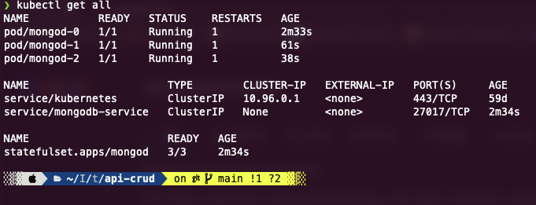
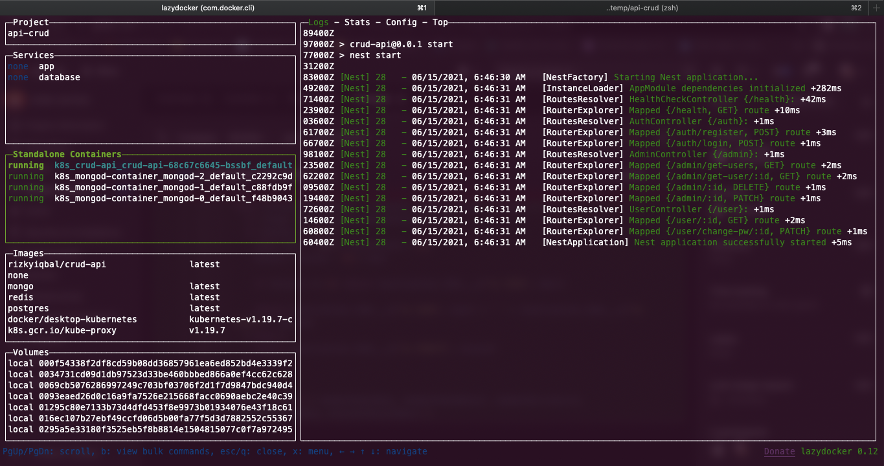
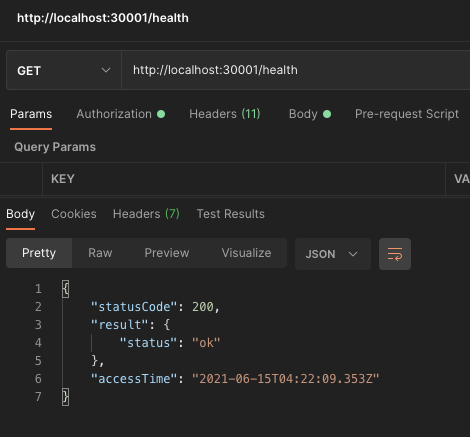
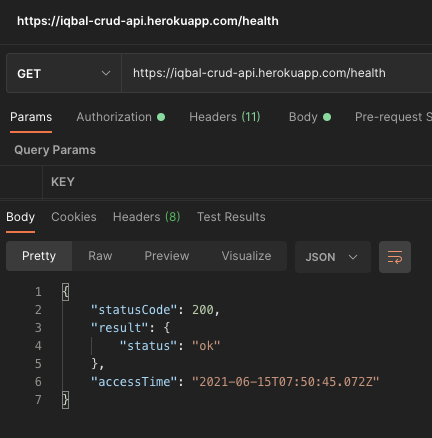

<p align="center">
  <a href="http://nestjs.com/" target="blank"></a>
</p>

[circleci-image]: https://img.shields.io/circleci/build/github/nestjs/nest/master?token=abc123def456
[circleci-url]: https://circleci.com/gh/nestjs/nest

<p align="center">This project was built using <a href="https://nestjs.com/" target="_blank">Nest.js</a>, a <a href="http://nodejs.org" target="_blank">Node.js</a> framework for building efficient and scalable server-side applications. under the hood nestjs is using expressjs, nest also support both typescript and javascript</p>

## Description

This project is using [this](https://github.com/Rizky-Iqbal36/NestJs-boilerplate/tree/refactor/mongodb) project as boilerplate

## Installation

```bash
# install dependencies
$ npm install

# get env variable

$ cp .env.example .env

# start service
$ npm run dependency:local
```

## Running the app

Note: Finish Installation first

```bash
# development
$ npm run start

# watch mode
$ npm run start:dev
```

## Test

You can see the test case on github action instead <br />

### Test Case List

- `User API`
  - Success => Should get a user
  - Success => User should change password and login with that password
  - Error => User access API should got error: Invalid token
  - Error => User access API should got error: Invalid token => authorization not set
  - Error => User access API should got error: Forbidden
  - Error => User access API should got error: User not found
  - Error => User access API should got error: User blocked
  - Error => Get user data should got error: No such a user
  - Error => Get user data should got error: Invalid param
- `Authentication API`
  - Success => Should register a user and return a token
  - Success => Should login a user and return a token
  - Error => login a user should got error: Wrong password or email
  - Error => Register a user should got error: Email already exist
  - Error => Register a user should got error: Invalid body
  - Error => Register a user should got error: Invalid body => Payload isAdmin === true
- `Admin API`
  - Success => Should get many user
  - Success => Should delete a user
  - Success => Should block and unblocking a user
  - Error => Should got error: user can't access Admin API
  - Error => Delete a user should got error: Invalid param
  - Error => Delete a user should got error: No such a user
  - Error => Blocking a user should got error: Invalid param
  - Error => Blocking a user should got error: No such a user
- `Health API`
  - should hit health check endpoint

if you want to run the test locally, finish the Installation first and run the command bellow

```bash
# integration tests
$ npm run test
```

## Endpoint List

| Methode |      Endpoint       |        API |
| ------- | :-----------------: | ---------: |
| GET     |       /health       | Health API |
| POST    |   /auth/register    |   Auth API |
| POST    |     /auth/login     |   Auth API |
| GET     |  /admin/get-users   |  Admin API |
| GET     | /admin/get-user/:id |  Admin API |
| DELETE  |     /admin/:id      |  Admin API |
| PATCH   |     /admin/:id      |  Admin API |
| GET     |      /user/:id      |   User Api |
| PATCH   | /user/change-pw/:id |   User APi |

## Kubernetes

### Statefulset MongoDB (Replica Set)

secure your mongodb keyfile: <br />

```console
whoam@i$ openssl rand -base64 741 > resources/secret/mongodb-keyfile
```

create kubernetes secret with the mongodb keyfile you just create: <br />

```console
whoam@i$ kubectl create secret generic mongo-key --from-file=resources/secret/mongodb-keyfile
```

check the mongo-key secret:

```console
whoam@i$ kubectl get secret
```

- now you R ready to apply resources/kubernetes/mongodb-statefulset.yaml
  ```console
  whoam@i$ kubectl apply -f resources/kubernetes/mongodb-statefulset.yaml
  ```
- wait until all the 3 pods R running
  
- define replica set in mongo bash in the running pod
  - by execute:
    ```bash
    whoam@i$ kubectl exec -it mongod-0 -- bash
    # now you can acces the pod bash
    ```
  - in pod bash, login to mongo, by execute:
    ```bash
      whoam@i$ mongo -u root -p developer
    ```
  - execute this command to make your own replica set with your own host
    ```bash
    rs.initiate({
      _id: 'MainRepSet',
      version: 1,
      members: [
        { _id: 0, host: 'mongod-0.mongodb-service:27017' },
        { _id: 1, host: 'mongod-1.mongodb-service:27017' },
        { _id: 2, host: 'mongod-2.mongodb-service:27017' }
      ]
    })
    ```
  - rs.status() to see if there is primary replica set, it will look similiar like this:
    ```json
      "members" : [
          {
            "_id" : 0,
            "name" : "mongod-0.mongodb-service:27017",
            ...
            "stateStr" : "PRIMARY",
            ...
          },
          {
            "_id" : 1,
            "name" : "mongod-1.mongodb-service:27017",
            ...
            "stateStr" : "SECONDARY",
            ...
            "syncSourceHost" : "mongod-0.mongodb-service:27017",
            ...
          },
          {
            "_id" : 2,
            "name" : "mongod-2.mongodb-service:27017",
            ...
            "stateStr" : "SECONDARY",
            ...
            "syncSourceHost" : "mongod-0.mongodb-service:27017",
            ...
          }
        ],
    ```
  - if not, exec "rs.slaveOk() || rs.secondaryOk()" to make host mongod-0.mongodb-service:27017 as primary
    - it's depend on which pod you are accessing the mongo bash
  - after that you can run this application on kubernetes: 
    ```bash
      whoam@i$ kubectl apply -f resources/kubernetes/deploy-app.yaml
    ```
  - wait until this app's pod is running
    
  - Done, the application is running on port 30001
    

## Docker 

 - You can see this project's image on this [link](https://hub.docker.com/repository/docker/rizkyiqbal/crud-api)
 - by default this image is set to connect to mongodb statefulset on kubernetes, but you can set it to connect to localhost by build and set the APP_ENV
    ```bash
      whoam@i$ docker build -t rizkyiqbal/crud-api --build-arg APP_ENV=local .
    ```
 - please see [.env.example](.env.example), [Dockerfile](Dockerfile) and [appConfig.js](src/app/config/appConfig.ts) for more details 

## Deployment 

 This project is live on [https://iqbal-crud-api.herokuapp.com/](https://iqbal-crud-api.herokuapp.com/health) <br />
 Note :
 - please see the [endpoint list](#endpoint-list)
 - header["x-user-id"] is required,so please fill it with the value of user._id
 - see [user.schema.ts](src/schema/requestvalidators/user.schema.ts) to check required body for post/patch method
 

## CI/CD
| Job Name  |                                   Description                                                 |
| --------- | :-------------------------------------------------------------------------------------------: |
| Test      |                                 Integration test                                              |
| Docker    |   Build and push this app's image to my [docker hub](https://hub.docker.com/u/rizkyiqbal)     |
| Deploy    |                              Deploy this app to heroku                                        |

## Support

Nest is an MIT-licensed open source project. It can grow thanks to the sponsors and support by the amazing backers. If you'd like to join them, please [read more here](https://docs.nestjs.com/support).

## Stay in touch

- Author - [Rizky Iqbal](mailto:rizkiiqbal36@gmail.com)
- Website - [https://rizky-iqbal.netlify.app](https://rizky-iqbal.netlify.app)
- Instagram - [@rizky_iqbal48](https://www.instagram.com/rizky_iqbal48)
- Twitter - [@rizkyiqbal36](https://www.twitter.com/rizkyiqbal36)
- Github - [Rizky-Iqbal36](https://github.com/Rizky-Iqbal36)
- Gitlab - [rizkyiqbal36](https://gitlab.com/rizkyiqbal36)

## License

This project is [MIT licensed](LICENSE).
